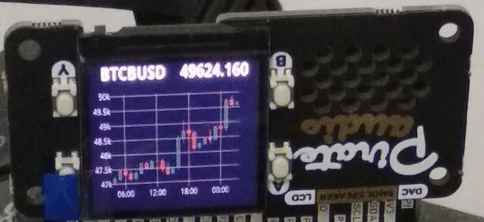
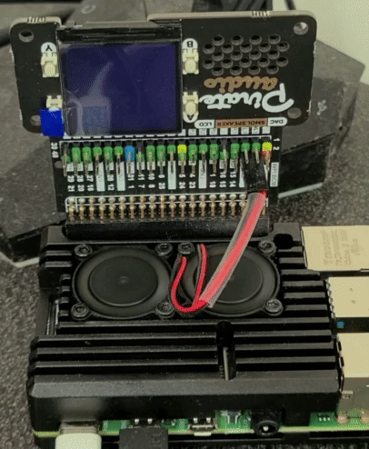
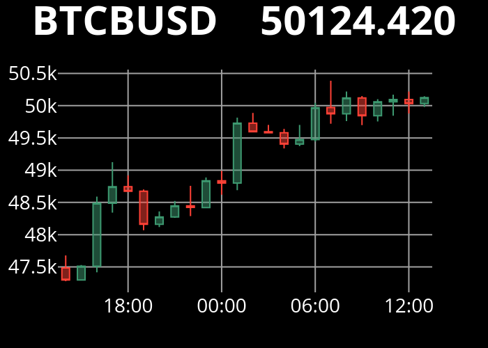

# multi-function bulletin-rpi
build a multi-function bulletin board on Raspberry Pi, which is able to show candlestick charts of cryptocurrency(bitcoin ticker), text notification, and read TTS from REST api




## hardware
* RPi
* LCD display HAT
* speaker for TTS (optional)

I'm using [Pirate Audio Speaker](https://shop.pimoroni.com/products/pirate-audio-mini-speaker) for both video and audio output

## TTS (optional)
* homeassistant

this project makes use of [google_translate](https://www.home-assistant.io/integrations/tts/) platform from homeassistant

## installation
using pipenv to create virtualenv and install all dependencies from Pipfile

```
export CFLAGS=-fcommon # for RPI.GPIO
pipenv install
```

## configuration
* edit settings to change notification font, color, etc..
* set your [binance api](https://www.binance.com/en/my/settings/api-management) key to get crypto info

## run
`pipenv run python3 rest.py`

## POST endpoint to upload animated gif and show each frame per interval (optional)
`curl http://localhost:5000/upload -F file=@<filename.gif> -F interval=<seconds>`

## POST endpoint to show text
### using animated gif as background (set background filename in settings)
`curl http://localhost:5000/notify -d "text=hello world" -X POST`

## GET endpoint to show cryptocurrency (pairs split by comma)
`curl http://localhost:5000/crypto?pair=BTCBUSD,ETHBUSD,BNBBUSD`
### 1H candlestick chart in last 24 hour period


## GET endpoint to blank LCD
`curl http://localhost:5000/clear`

# TODO
* add clock